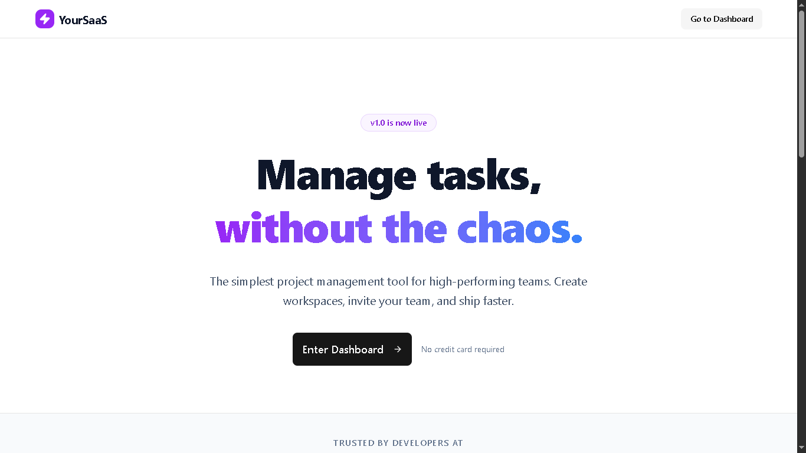
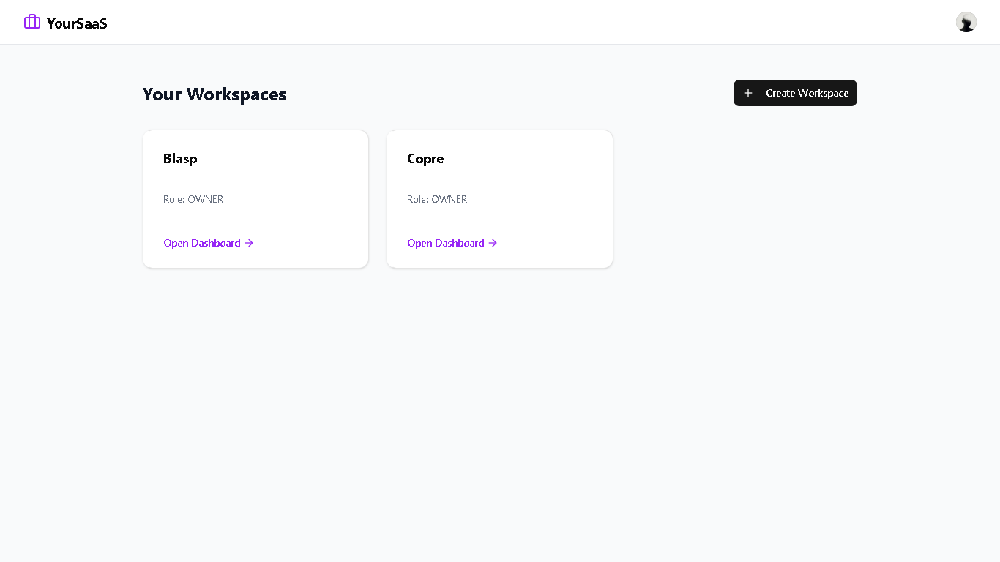
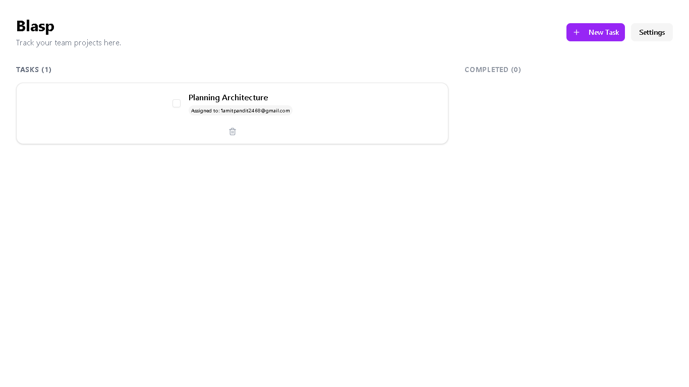

# Multi-Tenant SaaS Platform 🚀

A production-ready SaaS boilerplate built with the bleeding-edge **Next.js 15 App Router**. 
Features workspace isolation, team collaboration, and subscription billing.

**Live Demo:** [https://multi-tenant-saas-phi-indol.vercel.app](https://multi-tenant-saas-phi-indol.vercel.app)

## ✨ Key Features

- **🔐 Multi-Tenancy:** Complete data isolation between workspaces.
- **💳 Subscriptions:** Integrated Razorpay for PRO plan upgrades.
- **👥 Team Growth:** Email invitation system with secure magic links.
- **⚡ Next.js 15:** Server Actions, Async Components, and Partial Prerendering.
- **🎨 UI/UX:** Built with Tailwind CSS, shadcn/ui, and optimistic UI updates.

## 🛠️ Tech Stack

- **Framework:** Next.js 15 (App Router)
- **Database:** PostgreSQL (via Neon) + Prisma ORM
- **Auth:** Clerk (Middleware protected routes)
- **Payments:** Razorpay
- **Styling:** Tailwind CSS + Lucide Icons

## 📸 Screenshots
- Landing Page

- Dashboard

- Workspace

